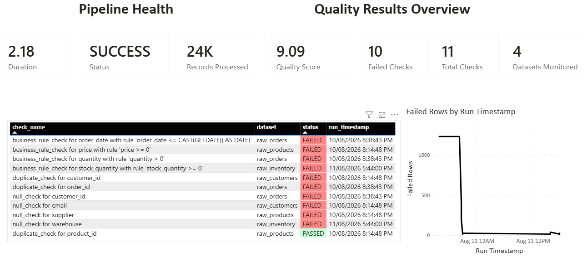

# Data Quality Monitoring Platform

A cloud native data quality monitoring platform I built with an existing Azure SQL database and messy operational data to simulate one of my projects at a company. The scope I owned included implementing validation checks, exposing them through an API, writing tests, and containerizing the service.

I modeled the sample data on the kind of records a retail apparel company might have (customers, products, orders, inventory).

## What it does

The platform ingests raw customer, product, order, and inventory data into Azure SQL, then runs a set of automated checks against it to catch the kinds of problems that break real reporting: missing values, duplicate records, invalid business values (negative prices, impossible quantities, future order dates), and schema drift. Every check result gets written to a `quality_results` table, and every full run gets logged in `pipeline_runs` with timing and volume info. A FastAPI service sits on top so the results are reachable over HTTP instead of only from a terminal.

## Structure

**Raw tables**: The raw tables (`raw_customers`, `raw_products`, `raw_orders`, `raw_inventory`) intentionally allow nulls and duplicates at the schema level, since the checks are supposed to be the thing that catches problems, not the schema.

**Surrogate keys instead of trusting business keys**: Every raw table uses an auto incrementing `id` as its actual primary key instead of `order_id` or `customer_id`. Those business keys are exactly what my duplicate check is meant to validate, so they can't also be the thing the database enforces uniqueness on.

**A YAML config**: `config/checks.yaml` defines which check runs against which table and column. The point of separating this from the Python code is that someone without a Python background could add or adjust a check by editing a config file instead of touching the validation engine.

## Tech stack

Python, FastAPI, SQLAlchemy, pymssql, PyYAML, Azure SQL Database (serverless tier), Docker, pytest, GitHub Actions, Azure Container Registry, Azure Container Apps, Azure Data Factory, Power BI.

## Project structure

The `data` folder holds the synthetic data generator and the CSVs it produces. `database` holds the SQLAlchemy models and the connection setup. `validation` holds the three check functions (null, duplicate, business rule), plus a `guards.py` module used for input validation. `config` holds the YAML file defining which checks run against which columns. `api` holds the FastAPI app. `tests` holds the pytest suite. `run_checks.py` at the root is the batch runner that ties the checks, the YAML config, and the database together.

## The pipeline, step by step

I generate synthetic customer, product, order, and inventory data with a fixed random seed, deliberately injecting nulls, duplicates, invalid values, and a schema change partway through the file, so the platform has real problems to catch. That data loads into Azure SQL through SQLAlchemy. `run_checks.py` reads the YAML config, dispatches each entry to the right check function, and writes the results into `quality_results`, along with a summary row in `pipeline_runs` that tracks how long the run took and how many records it touched.

## API

Four endpoints, all backed by live queries against Azure SQL.

`GET /` is a basic health check.

`GET /quality-report` returns the most recent result for every check (using a window function to get the latest row per check name, since the same check runs repeatedly over time), along with a computed quality score.

`GET /pipeline-status` returns the most recent full pipeline run: status, records processed, and duration.

`POST /validate/{dataset}` takes a friendly dataset name like `orders`, maps it to the real table name through a small whitelist (so nothing arbitrary can reach the SQL layer), runs just the checks relevant to that dataset, and persists the results the same way the batch runner does.

## Security

The three check functions build SQL by interpolating table and column names, which would be a real SQL injection risk if that input ever came from outside my own code. `validation/guards.py` closes that gap: before any check builds a query, it validates the table and column names against the actual SQLAlchemy schema in `models.py`, using the schema itself as the source of truth. Anything that isn't a real table or a real column on that table gets rejected before it ever reaches the database.

## Testing

The pytest suite covers all three check functions against known values from the seeded synthetic data, plus all four API endpoints using FastAPI's test client. These are real integration tests, but they run against a dedicated test database, so a CI run never touches production data or leaves test artifacts sitting in `quality_results`.

## Docker and CI

The service is containerized with a Dockerfile that installs dependencies before copying application code. I set up GitHub Actions to build and validate everything remotely. The CI pipeline runs four jobs on every pull request: linting with ruff, the Docker build, the full pytest suite with coverage reporting, and a secret scan to catch any credentials that might accidentally get committed. The `main` branch is protected, so none of that can be skipped: changes have to go through a pull request and pass every check before they can merge. On every merge to `main`, the same pipeline logs into Azure Container Registry, pushes the newly built image, and then rolls that image out to Azure Container Apps automatically, so a merge results in a live deployment without a manual redeploy step.

## Deployment

The API is deployed to Azure Container Apps, pulling its image from Azure Container Registry, and is publicly reachable over HTTPS. The database credentials are passed in as Container Apps secrets at runtime, the same pattern used for local development with a `.env` file. The entire build and deploy path runs through GitHub Actions and Azure infrastructure.

## Orchestration

The four validation runs and the dashboard refresh are tied together with an Azure Data Factory pipeline instead of running on independent schedules. Four Web Activities call `POST /validate/{dataset}` for customers, products, orders, and inventory in sequence, each one only firing after the previous one succeeds, so a slow or failed run doesn't let a later step proceed against incomplete data. A fifth Web Activity calls the Power BI REST API to trigger a dataset refresh, and it only runs once all four validation steps have genuinely completed. A daily trigger kicks the whole chain off automatically, so the pipeline runs and the dashboard reflects the results without anyone manually running a script or clicking refresh.

## Dashboard

I built a Power BI report on top of `quality_results` and `pipeline_runs`, covering the same three areas the original project plan called for: an overview with the current quality score and failed check count, a pipeline health view with the latest run's status and duration, and a table of every check with conditional formatting on status, plus a trend line of failed rows over time.

## Setup

You will need an Azure SQL database, the ODBC free `pymssql` driver (no separate driver install required), and a `.env` file with your connection details (`AZURE_SQL_SERVER`, `AZURE_SQL_DB`, `AZURE_SQL_USER`, `AZURE_SQL_PASSWORD`), which is excluded from the repo through `.gitignore`.

Install the dependencies from `requirements.txt` for running the app, and `requirements-dev.txt` for linting and testing. Run `data/generate_data.py` to produce the synthetic CSVs, then `database/load.py` to load them into Azure SQL, then `run_checks.py` to run the full validation batch. To bring up the API, run uvicorn against `api.main:app`. The interactive docs are available at `/docs` once it's running.